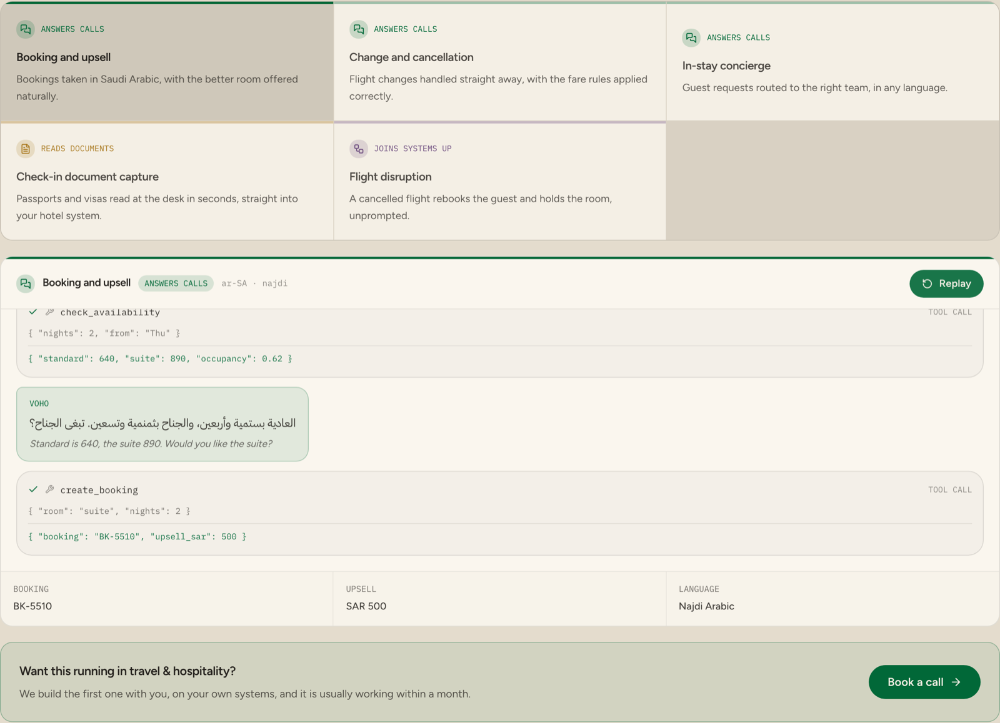

# Saudi Travel & Hospitality Voice Agent

> A free Arabic voice agent for Saudi hotels and travel operators — bookings, changes and guest requests in Najdi Arabic, self-hosted.

**Free, MIT licensed, and built to run on your own infrastructure.** No seats,
no per-agent pricing, nothing calling home. `docker compose up` and it is
running inside your network.

<p align="center">
  <a href="https://voho.ai/demos/travel-hospitality">
    
  </a>
</p>

<p align="center">
  <b><a href="https://voho.ai/demos/travel-hospitality">▶ Play the live demo</a></b> — runs in your browser, no sign-up.
</p>

<!-- voho:try -->
## Try it in your browser first

You do not have to clone anything to see whether this works for you. The same
engine this repository calls is running at **[app.voho.ai/agents](https://app.voho.ai/agents)** —
build an agent and talk to it out loud, in the browser, in about a minute.

New accounts start with **$25 of credit**, and one balance and one API key
cover every Voho product: AI Call Center, and the five beside it.

- **[Build an agent and talk to it out loud →](https://app.voho.ai/agents)**
- [Get an API key](https://app.voho.ai/tokens) — the key this repository needs
- [Read the API docs](https://docs.voho.ai)

Running it inside your own estate, against your own systems, is what we do
with you: [talk to us](https://voho.ai/book-demo).

---

---

## The problem

Guests calling in Arabic at midnight about a booking made in English through an aggregator.

This is for hotel groups, travel agencies and Hajj and Umrah operators. Every conversation is in **Najdi Arabic** — the
dialect of Riyadh and central Saudi Arabia — and every one ends in something
happening in a real system, not in a promise that somebody will call back.

## What it does out of the box

| Scenario | | |
| --- | --- | --- |
| `booking` | Booking and upsell | Bookings taken in Saudi Arabic, with the better room offered naturally. |
| `change` | Change and cancellation | Flight changes handled straight away, with the fare rules applied correctly. |
| `concierge` | In-stay concierge | Guest requests routed to the right team, in any language. |

Play one end to end, in the terminal:

```bash
python setup.py                     # get a Voho key — a minute, once
python examples/play.py booking
```

Every line is spoken with Voho and written to `out/`, so you hear what a
caller would hear. `--silent` reads the conversation without audio, and needs
no key at all.

The tools (`check_availability`, `check_fare_rules`, `create_booking`, `housekeeping_request`, `rebook_flight`, `reserve_table`) replay the results recorded with each scenario, so the
whole conversation runs on an empty machine. Connecting a system means
replacing one stub at a time.

### Also included as reference scenarios

| Scenario | | |
| --- | --- | --- |
| `checkin-docs` | Check-in document capture | a hard document read into fields |
| `disruption` | Flight disruption | an event carried across several systems |

These are not conversations, so the engine does not play them — they are the recorded shape of the document, the archive answer or the workflow, kept here because they are the same job in the same sector.

## Run it on your own infrastructure

```bash
git clone https://github.com/yar-malik/saudi-travel-voice-agent.git
cd saudi-travel-voice-agent
pip install -r requirements.txt

python setup.py          # asks for your Voho key and verifies it
docker compose up --build
```

`setup.py` walks you through creating a token at
[app.voho.ai](https://app.voho.ai) under **API Tokens**, checks it against the
live voice catalogue so a typo fails now rather than on a call, and writes it
to `.env`. The server refuses to start without one — a line that answers and
then cannot speak is worse than one that never came up.

The container runs as a non-root user with a read-only filesystem and
`no-new-privileges`, because the first question your security review will ask
is whether it needs root. It does not.

Nothing phones home. The single outbound call is speech synthesis — and
pointing `VOHO_BASE_URL` at a Voho deployment inside your own network removes
even that, at which point the container runs with no internet at all.

## Connecting your systems

Each scenario names the tools it calls, with the arguments they take and the
result they returned when it was recorded. That recording is the contract:

```python
from tools import implement

@implement("check_availability")
def check_availability(nights: int, from: str) -> dict:
    # your system here
    return {"standard": 640, "suite": 890, "occupancy": 0.62}
```

Anything you have not implemented keeps replaying the recording, and
`GET /flows` lists what is still stubbed — so a half-finished integration is
visible rather than quietly pretending.

In travel and hospitality, that usually means:

| System | What it is for |
| --- | --- |
| **Shomoos** | guest registration, which has to be right before check-in |
| **Nusuk** | Hajj and Umrah permits and itineraries |
| **Absher** | identity for a booking made in someone else's name |
| **Your PMS and booking engine** | the reservation that has to move when the caller's plans do |

These are integration points you wire up yourself. Nothing here is a certified
connector, and no affiliation with any of these platforms is claimed.

## Two ways to run this

**Let Voho be the whole agent.** A Voho voice agent answers the line, hears the
caller in Saudi Arabic, works out what they actually want, takes the action in
your systems, stops talking the moment it is interrupted, hands over to a
person when it should, and leaves a bilingual transcript and summary behind.
Hearing, deciding and speaking are all Voho's — you configure the agent and its
actions rather than writing any of this. It is the fastest route to a live
line.

**Or assemble it yourself, the way this repository does.** Here the
conversation lives in code you can read line by line, the tools are yours, and
Voho's Speech API provides the voice. Worth it when the script has to be
reviewed before it goes anywhere near a caller, or when every part has to sit
inside your own network.

| Part | In this repository | With a Voho agent |
| --- | --- | --- |
| Hearing the caller | whichever recogniser you point [`stt.py`](stt.py) at | Voho |
| Deciding what to do | scripted beats in [`agent.py`](agent.py) | Voho |
| Acting in your systems | your code in [`tools.py`](tools.py) | Voho actions, calling your API |
| Speaking | Voho, via [`voho.py`](voho.py) | Voho |
| Transcript and summary | yours to keep | Voho, in Arabic and English |

Both end in the same place. Start with whichever suits the team you have.

## On a real phone number

```bash
export PUBLIC_URL=https://your-tunnel.ngrok.io
python server.py
```

Point a Twilio number's **Voice** webhook at `POST /voice`. Audio is available
as 8 kHz mulaw, which is what Cisco, Avaya and SIP trunks already carry, so
there is no transcoding step on your side.

## The rest of the series

One repository per sector, each with its own scenarios and its own demo:

| Repository | Sector | Live demo |
| --- | --- | --- |
| [saudi-healthcare-voice-agent](https://github.com/yar-malik/saudi-healthcare-voice-agent) | Healthcare | [Play it](https://voho.ai/demos/healthcare) |
| [saudi-banking-voice-agent](https://github.com/yar-malik/saudi-banking-voice-agent) | Banking | [Play it](https://voho.ai/demos/banking) |
| [saudi-financial-services-voice-agent](https://github.com/yar-malik/saudi-financial-services-voice-agent) | Financial services | [Play it](https://voho.ai/demos/financial-services) |
| [saudi-insurance-voice-agent](https://github.com/yar-malik/saudi-insurance-voice-agent) | Insurance | [Play it](https://voho.ai/demos/insurance) |
| [saudi-logistics-voice-agent](https://github.com/yar-malik/saudi-logistics-voice-agent) | Logistics | [Play it](https://voho.ai/demos/logistics) |
| [saudi-retail-voice-agent](https://github.com/yar-malik/saudi-retail-voice-agent) | Retail and consumer goods | [Play it](https://voho.ai/demos/retail-consumer) |
| [saudi-debt-collection-voice-agent](https://github.com/yar-malik/saudi-debt-collection-voice-agent) | Debt collection | [Play it](https://voho.ai/demos/debt-collection) |
| [saudi-home-services-voice-agent](https://github.com/yar-malik/saudi-home-services-voice-agent) | Home services | [Play it](https://voho.ai/demos/home-services) |

## Want this in production?

We build the first workflow with you, on your own systems — usually live
within a month.

**[Book a call →](https://voho.ai/book-demo)** · [All the demos](https://voho.ai/demos) · [Documentation](https://docs.voho.ai)

---

MIT licensed. Built by [Voho](https://voho.ai) — enterprise AI for Saudi Arabia.
